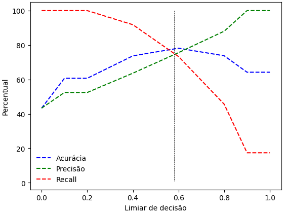
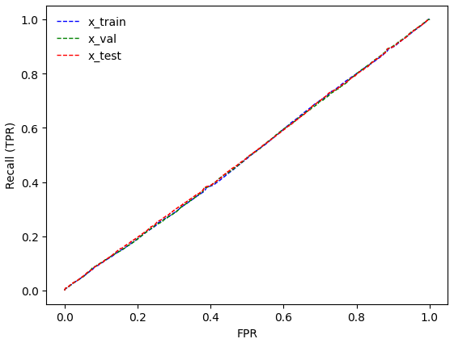
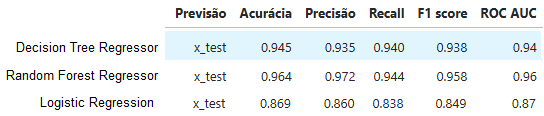
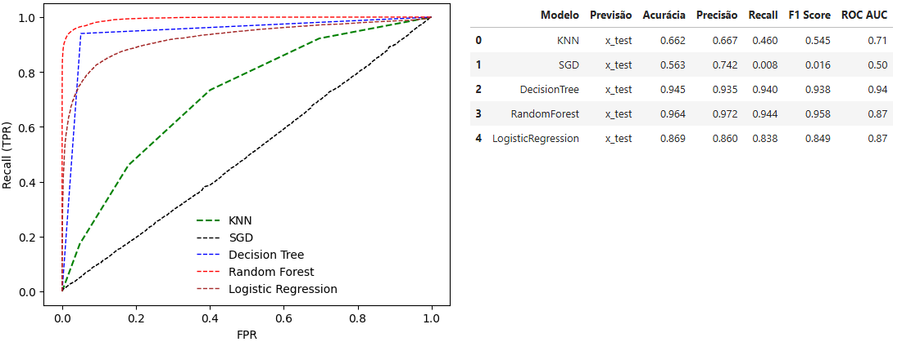
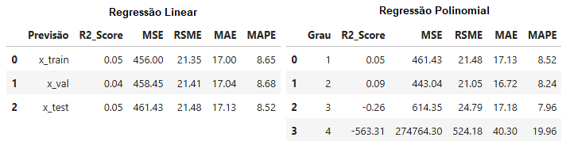
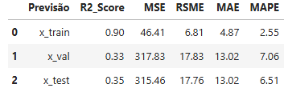
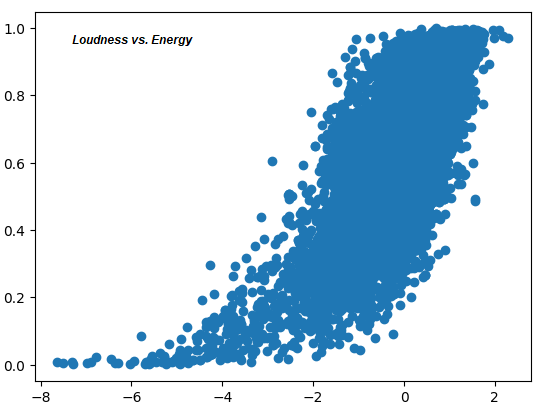

# Apresentação

  
Este projeto de ciência de dados foi desenvolvido para adquirir experiência quanto à utilização dos algoritmos de <em>machine learning</em> na execucão de tarefas de classificação, regressão e agrupamento. Os conjuntos de dados foram disponibilizados no curso Fundamentos de <em>Machine Learning</em> ministrado pelo professor Meigarom na <a href = "https://comunidadeds.com/)">Comunidade DS</a>.
 

# Objetivo
>
>> 
O objetivo deste projeto foi avaliar a performance de algoritmos de aprendizado supervisionado e não supervisionado na execução de tarefas de classificação, regressão e agrupamento (clusterização).
 
>> 
>>
>><table width="600">
>>  <tr>
>>     <td><strong>Tipo de Aprendizado<strong></td>
>>     <td><strong>Algoritmo</strong></td>
>>     <td><strong>Tarefa</strong></td>
>>     <td><strong>Métricas de Performance</strong></td>
>>  </tr>
>>  <tr>
>>    <td rowspan="5" style="vertical-align: top;">Supervisionado</td>
>>    <td>K-Nearest Neighbor (KNN)</td>
>>    <td rowspan="5" style="vertical-align: top;">Classificação</td>
>>    <td>Acurácia</td>
>>  </tr>
>>  <tr>
>>    <td>Stochastic Gradient Descent Classifier (SGD)</td>
>>    <td>Precisão</td>
>>  </tr>
>>  <tr>
>>    <td>Decision Tree</td>
>>    <td>Revocação (Recall)</td>
>>  </tr>
>>  <tr>
>>    <td>Random Forest</td>
>>    <td>Pontuação F1 (F1 score)</td>
>>  </tr>
>>  <tr>
>>    <td>Logistic Regression</td>
>>    <td>Pontuação ROC AUC</td>
>>  </tr>
>>  <tr>
>>    <td rowspan="5" style="vertical-align: top;">Supervisionado</td>
>>    <td>Linear Regression</td>
>>    <td rowspan="5" style="vertical-align: top;">Regressão</td>
>>    <td>Coeficiente de Determinação (R2)</td>
>>  </tr>
>>  <tr>
>>    <td>Polinomial Regression</td>
>>    <td>Mean Squared Error (MSE)</td>
>>  </tr>
>>  <tr>
>>    <td>Lasso, Ridge and ElasticNet regularizations</td>
>>    <td>Root Mean Squared Error (RMSE)</td>
>>  </tr>
>>  <tr>
>>    <td>Decision Tree Regressor</td>
>>    <td>Mean Absolute Error (MAE)</td>
>>  </tr>
>>  <tr>
>>    <td>Random Forest Regressor</td>
>>    <td>Mean Absolute Percentage Error (MAPE)</td>
>>  </tr>
>>  <tr>
>>    <td rowspan="2" style="vertical-align: top;">Não Supervisionado</td>
>>    <td>K-Means</td>
>>    <td rowspan="2" style="vertical-align: top;">Clusterização</td>
>>    <td>Within Cluster Sum of Squares (WCSS)</td>
>>  </tr>
>>  <tr>
>>    <td>Affinity Propagation</td>
>>    <td>Coeficiente de silhueta (Silhouette score)</td>
>>  </tr>
>></table>
>>
>> ## Objetivos Específicos
>>
>> - 
Avaliar a performance de algoritmos supervisionados (<em>Stochastic Gradient Descent Classifier</em> - SGD, <em>K Nearest Neighbor Classifier</em> - KNN, <em>Decision Tree Classifier</em>, <em>Random Forest Classifier</em> e <em>Logistic Regression</em>) em ensaio de classificação utilizando métricas diversas.
 

>> - 
Avaliar a performance de algoritmos supervisionados (regressão linear e regressão linear com regularizações (Lasso, Ridge e Elastic Net), regressão polinomial e regressão polinomial com regularizações (Lasso, Ridge e Elastic Net), <em>Decision Tree Regressor</em> e <em>Random Forest Regressor</em>) em ensaio de regressão utilizando métricas diversas.
 

>> -  
Avaliar a performance de algoritmos não supervisionados (<em>K Means</em>, <em>Affinity Propagation</em>) em ensaio de clusterização utilizando métricas diversas.
 

# Metodologia
>
>> ## <em>Datasets</em>
>>
>> 
Três conjuntos de dados foram utilizados para condução dos ensaios de classificação (diretório datasets/classificacao/), regressão (diretório datasets/regressao/) e clusterização (diretório datasets/clusterizacao/). Conjuntos de dados diferentes foram utilizados para ajuste (X_training.csv e y_training.csv) e avaliação dos algoritmos supervisionados (X_validation, X_test, y_validation e y_test) e um conjunto de dados para os algoritmos não supervisionados (X_dataset.csv). Após ajuste dos modelos, as predições foram feitas utilizando os conjuntos de treinamento, validação e teste para avaliar as generalizações dos modelos.
 
>
>> 
>> ## Métricas para avaliação da performance dos modelos
>>
>> 
As métricas acurácia, precisão, revocação (<em>recall</em>) e pontuação F1 (<em>F1 score</em>) foram utilizadas para avaliar a performance dos algoritmos supervisionados para classificação. Elas foram calculadas a partir da construção da matriz de confusão (tabela abaixo).
>
>>
>>|                                 | <strong>Previsão (Classe 0)</strong> | <strong>Previsão (Classe 1)</strong> |
>>|---                              |---                                   |                                   ---|
>>| <strong>Real (Classe 0)</strong>| TN                                   |                                   FP |
>>| <strong>Real (Classe 1)</strong>| FN                                   |                                   TP |
>> 
>>
>>
onde, TP (<em>True Positive</em>) é a quantidade de instâncias corretamente classificadas como Classe 1; TN (<em>True Negative</em>) é a quantidade de instâncias corretamente classificadas como Classe 0; FN (<em>False Negative</em>) e FP (<em>False Positive</em>) são as quantidades de instâncias incorretamente classificadas como Classe 0 e Classe 1, respectivamente.
 
>
>>
Além das métricas acima mencionadas, foi utilizada a área sob a curva característica de operação do recebedor (<em>area under the receiver operating characteristic curve </em> - ROC AUC) para comparação com a curva proveniente de algoritmo aleatório.
 
>
>>
As métricas coeficiente de determinação (<em>R</em>2), erro quadrático médio (MSE), raiz quadrada do erro quadrático médio (RMSE), erro absoluto médio (MAE) e erro absoluto médio percentual (MAPE) foram utilizadas para avaliar a performance dos algoritmos supervisionados para regressão.
 
>
>>
As métricas coeficiente médio de silhueta e soma dos quadrados intra-custers (<em>Within-Cluster Sum of Squares</em> - WCSS) foram utilizadas para avaliar a performance dos algoritmos não supervisionados para clusterização.
 
>
>> ## Avaliação comparativa das métricas
>>
>>
Tabelas foram construídas para comparar as métricas após as previsões utilizando os conjuntos de treino, validação e teste. Gráficos de dispersão foram construídos para avaliar a variação das métricas precisão e revocação bem como a variação das métricas em função de determinados parâmetros. A curva ROC foi utilizada para avaliar todos os algoritmos supervisionados de classificação.
 

# Resultados Principais
>>
>>
(<strong>Ensaio de classificação com KNN</strong>) O limiar de decisão aproximdamente igual a 0.6 maximizou as métricas acurácia, precisão e revocação. A partir do limiar de 0.73, a precisão diminuiu rapidamente (seções 3.1.2 e 3.1.3 do notebook ensaio_classificacao.ipynb). O algoritmo otimizado com base na precisão (k = 4; seções 3.1.4) apresentou resultados moderados (acurácia: 66%; precisão: 67%; recall: 46%; F1 score: 55% e ROC AUC: 0.71; seção 3.1.5).
 
>>
>>

>>
>>
(<strong>Ensaio de classificação com SGD</strong>)O algoritmo SGD apresentou baixa performance em geral, provavelmente porque classificou as instâncias de forma aleatória tal como indicado pela curva ROC e pela pontuação ROC AUC igual a 0.5 (seção 4).
 
>>
>>

>>
>>
(<strong>Ensaios de classificação com Decision Tree Classifier, Random Forest Classifier e Logistic Regression</strong>) Os algoritmos Decision Tree Classifier e Random Forest Classifier apresentaram resultados satisfatórios de previsão das classes (0 ou 1) (seções 5 e 6), seguidos do algoritmo Logistic Regression (seção 7).
 
>>
>>

>>
>>
(<strong>Curva ROC e métricas dos ensaios de classificação</strong>) Os algoritmos Decision Tree Classifier e Random Forest Classifier apresentaram os melhores resultados tal como indicado pela curva ROC e pelas demais métricas.
 
>>
>>

>>
>>
(<strong>Ensaio de regressão</strong>) Os algoritmos de regressão linear e polinomial não apresentaram performances satisfatórias (seções 3 e 6 do notebook ensaio_regressao.ipynb) e as regularizações não melhoraram significativamente as métricas de performance (seção 7).
 
>>
>>

>>
>>
(<strong>Ensaio de regressão com  <em>Decision Tree Regressor</em></strong>) O algoritmo não apresentou performance satisfatória mesmo com a otimização dos hiperparâmetros utilizando o GridSearch (seção 4). Neste ensaio, observaram-se erros mais baixos com max_depth igual a 6 (seção 4.1) e max_features igual a 8 (seção 4.3). A otimização de hiperparâmetros com GridSearch não melhorou significativamente a performance do algoritmo (seção 4.5).
 
>>
>>
(<strong>Ensaio de regressão com  <em>Random Forest Regressor</em></strong>) O algoritmo apresentou performance moderada (seção 5) e a otimização com Grid Search não aperfeiçoou o algoritmo (seção 5.1).
 
>>
>>

>>
>>
(<strong>Ensaios de clusterização</strong>) Os algoritmos apresentaram coeficientes de silhuetas baixos mesmo após a otimização de hiperparâmetros com GridSearch (notebook ensaio_clusterizacao.ipynb)
 

# Conclusão
>>
>>
 Os algoritmos Random Forest Classifier e Random Forest Regressor apresentaram as melhores performances na execução das tarefas de classificação e regressão, respectivamente.
 

# Perspectivas
>>
>>
 Os resultados dos algoritmos paramétricos de regressão (regressão linear e polinomial com ou sem regularizações) indicaram a necessidade de processamento prévio dos dados antes do ajuste dos modelos. Esse processamento deve considerar a multicolinearidade de variáveis independentes (por exemplo, as variáveis <em>loudness</em> e <em>energy</em>) (seção 8 do notebook ensaio_regressao.ipynb), a existência de valores extremos e a distribuição dos valores. Esse processamento será feito para aperfeiçoar os algoritmos de aprendizado de máquina.
 
>>
>>

# Ferramentas utilizadas
>>
>> - <em>Python</em> (versão 3.9.21), <em>Scikit-learn</em> e algoritmos de aprendizado de máquina.
>> - WSL para gerenciamento de ambiente virtual.
>> - Git para versionamento dos arquivos e envio para o repositório Github.
>> - Jupyter notebook para ajuste dos modelos de aprendizado de máquina
>> - VS Code para construção do arquivo Readme.md

# Habilidades Desenvolvidas
>>
>> - Análise de dados.
>> - Utilização de algoritmos supervisionados de aprendizado de máquina
>> - Utilização de algoritmos não supervisionados de aprendizado de máquina
>> - Interpretação de métricas de performance dos algoritmos

